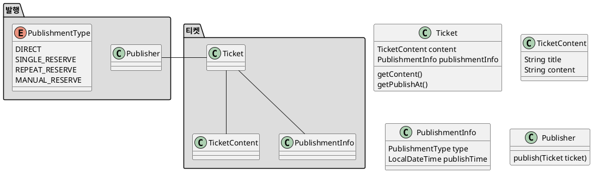

```plantuml
@startuml
package "티켓" #DDDDDD {
  Ticket -- TicketContent
  Ticket -- PublishmentInfo
}

package "발행" #DDDDDD {
  enum PublishmentType {
    DIRECT
    SINGLE_RESERVE
    REPEAT_RESERVE
    MANUAL_RESERVE
  }

  Publisher - Ticket
}

class Ticket {
  TicketContent content
  PublishmentInfo publishmentInfo
  getContent()
  getPublishAt()
}
class TicketContent {
  String title
  String content
}
class PublishmentInfo {
  PublishmentType type
  LocalDateTime publishTime
}

class Publisher {
  publish(Ticket ticket)
}


@enduml
```